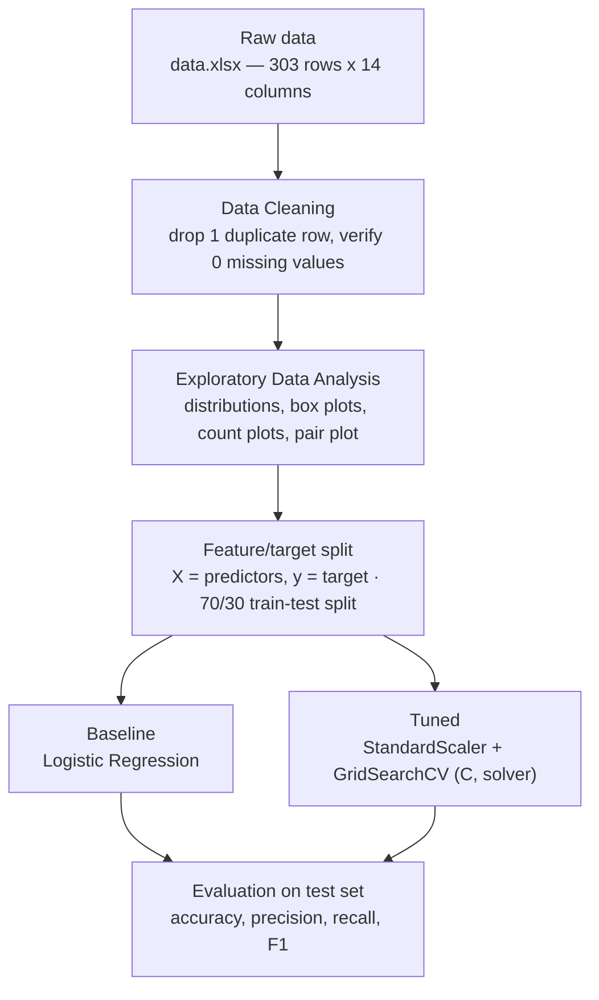
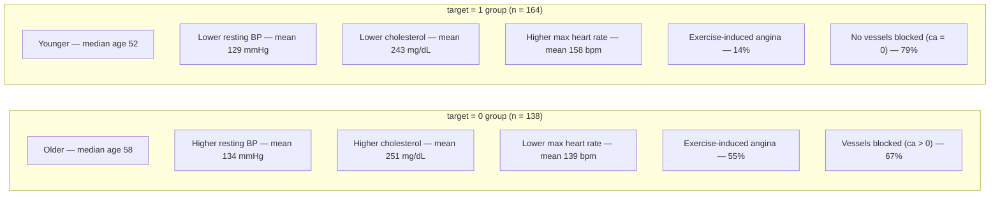
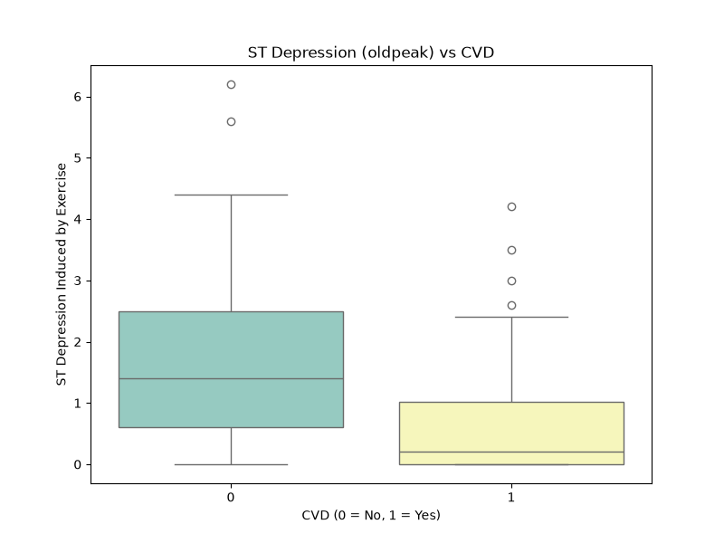
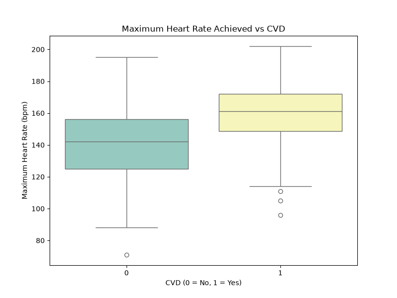
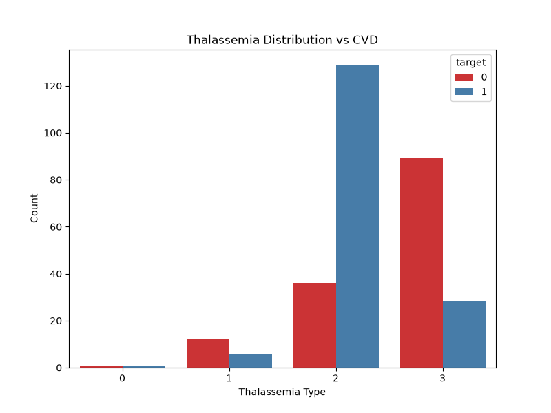
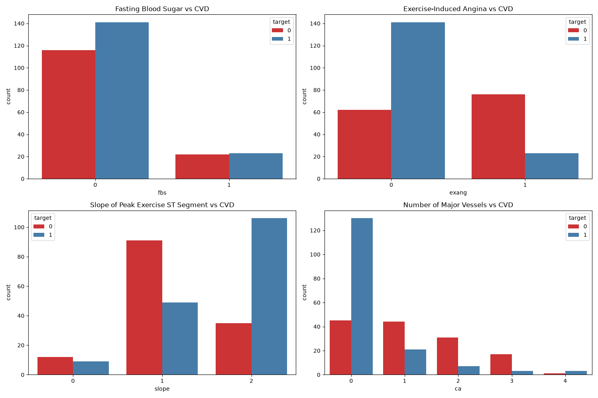
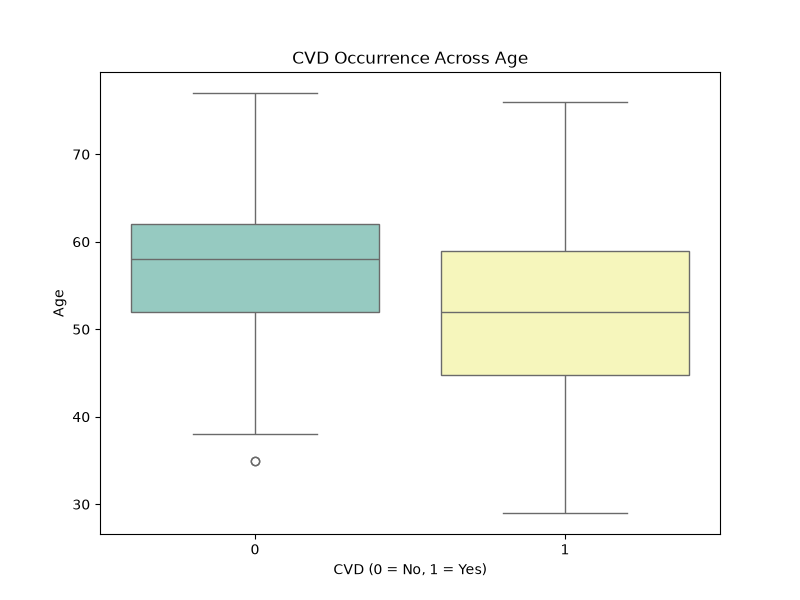

# Cardiovascular-Disease-CVD

## Problem Statement

Cardiovascular diseases are the leading cause of death globally. To identify the causes and to develop a system to predict heart attack in an effective manner is necessary. The presented data has all information about all the relevant factors that might have an impact on heart health. The data needs to be explained in detail for any further analysis.

| **Variable** | **Description**                                                                 |
|--------------|---------------------------------------------------------------------------------|
| age          | age in years                                                                    |
| sex          | (1 = male; 0 = female)                                                          |
| cp           | chest pain type                                                                 |
| trestbps     | resting blood pressure (in mm Hg on admission to the hospital)                  |
| chol         | serum cholestoral in mg/dl                                                      |
| fbs          | (fasting blood sugar > 120 mg/dl) (1 = true; 0 = false)                        |
| restecg      | resting electrocardiographic results                                            |
| thalach      | maximum heart rate achieved                                                     |
| exang        | exercise induced angina (1 = yes; 0 = no)                                       |
| oldpeak      | ST depression induced by exercise relative to rest                              |
| slope        | the slope of the peak exercise ST segment                                       |
| ca           | number of major vessels (0-3) colored by flourosopy                             |
| thal         | 3 = normal; 6 = fixed defect; 7 = reversible defect                             |
| target       | 1 or 0                                                                          |


### 1.Preliminary analysis:
     
    
   1.Perform preliminary data inspection and report the findings as the structure of the data, missing values, duplicates etc.
  
   2.Based on the findings from the previous question remove duplicates (if any) , treat missing values using appropriate strategy.

### 2.Prepare an informative report about the data explaining distribution of the disease and the related factors. You could use the below approach to achieve the objective
     
     
   1.Get a preliminary statistical summary of the data. Explore the measures of central tendencies and the spread of the data overall.
   
   2.Identify the data variables which might be categorical in nature. Describe and explore these variables using appropriate tools e.g. count plot
   
   3.Study the occurrence of CVD across Age.
   
   4.Study the composition of overall patients w.r.t . Gender.
   
   5.Can we detect heart attack based on anomalies in Resting Blood Pressure of the patient?
   
   6.Describe the relationship between Cholesterol levels and our target variable.
   
   7.What can be concluded about the relationship between peak exercising and occurrence of heart attack.
   
   8.Is thalassemia a major cause of CVD?
   
   9.How are the other factors determining the occurrence of CVD?
   
   10.Use a pair plot to understand the relationship between all the given variables.


### 3.Build a baseline model to predict using a Logistic Regression and explore the results.   

## How to Run

The analysis is a plain Python script — no Jupyter required. From a VS Code terminal (or any shell) in the repo root:

```bash
pip install pandas numpy matplotlib seaborn scikit-learn openpyxl
python3 cvd_analysis.py
```

This prints the data-cleaning report, summary statistics, and both models' classification reports to the terminal, and writes all 10 EDA figures to `output/figures/` (the 5 most informative ones are also checked into [`assets/figures/`](assets/figures/) and embedded below).

## Analysis Pipeline



## Key Findings

> **A note on the `target` column before reading these findings.** The column is documented as `1 = disease, 0 = no disease`, but every clinical marker in the actual data points the opposite way: rows labeled `target = 1` consistently show the *lower-risk* profile (younger, lower resting blood pressure, lower cholesterol, higher exercise heart rate, far less exercise-induced angina, fewer blocked vessels), while `target = 0` rows look like the higher-risk group. This is a widely-reported quirk of this particular public copy of the Cleveland heart-disease dataset — the original UCI severity score (0–4) appears to have been binarized with the 0/1 sense inverted at some point before this file was published. The numbers below describe **what the two groups in this file actually look like**, without assuming which label means "diseased" — verify against the original UCI source before treating either label as ground truth for a real diagnosis.



### Which factors actually matter most

Not every chart carries equal weight. Ranking each feature by effect size — Cohen's *d* for continuous variables, proportion gap for categorical ones — separates the strong signals from the noise:

| Feature | Effect size | Value |
|---|---|---|
| `oldpeak` (ST depression) | d = 0.93 | 🔴 Highest |
| `thalach` (max heart rate) | d = 0.92 | 🔴 Highest |
| `thal` (thalassemia code 2) | gap = 0.53 | 🟠 High |
| `ca` (zero vessels blocked) | gap = 0.47 | 🟠 High |
| `age` | d = 0.46 | 🟠 High |
| `exang` (exercise angina) | gap = 0.41 | 🟠 High |
| `sex` | gap = 0.27 | 🟡 Moderate |
| `trestbps` (resting BP) | d = 0.29 | 🟡 Moderate |
| `chol` (cholesterol) | d = 0.16 | ⚪ Low |
| `fbs` (fasting blood sugar) | gap = 0.02 | ⚪ Negligible |

The five charts below are the ones actually worth reading closely — each shows a clear, visible split between the two groups, unlike cholesterol or fasting blood sugar, which look nearly identical across both.

**1. ST depression (`oldpeak`) — the single strongest split in the dataset**



The `target = 0` group's median ST depression (1.4) is seven times higher than the `target = 1` group's (0.2), with almost no overlap between the boxes — the cleanest separation of any variable.

**2. Maximum heart rate (`thalach`)**



`target = 1` patients reach a visibly higher peak heart rate during exercise (median 161 vs. 142 bpm) — the two boxes barely overlap.

**3. Thalassemia type (`thal`)**



Code `2` dominates the `target = 1` group (79%) while code `3` dominates `target = 0` (65%) — thalassemia result is one of the most informative categorical features.

**4. Exercise-induced angina & major vessels (`exang`, `ca`)**



Look at the top-right and bottom-right panels: angina during exercise is nearly 4x more common in the `target = 0` group (55% vs. 14%), and having zero vessels colored by fluoroscopy is far more common in `target = 1` (79% vs. 33%). The top-left (`fbs`) and bottom-left (`slope`) panels are included for completeness but show a much weaker split.

**5. Age**



`target = 0` skews older (median 58 vs. 52) — a real but noticeably weaker signal than the four charts above, and the opposite direction from the original notebook's claim that older patients were more likely to be `target = 1`.

**Lower-value charts, for completeness:** resting blood pressure and cholesterol (both generated by the script in `output/figures/`) show large overlap between the two groups and are weak predictors on their own — consistent with their low effect sizes in the table above.

## Model Results

| Model | Data | Accuracy |
|---|---|---|
| Baseline Logistic Regression | Raw features | 82% |
| Logistic Regression + `StandardScaler` + `GridSearchCV` tuning | Scaled features | 82% |

On this dataset, scaling features and tuning `C`/`solver` via grid search did **not** raise accuracy beyond the baseline — both settle at 82%, with the tuned model shifting the precision/recall balance slightly between classes rather than improving overall accuracy. With only 302 rows, a 91-row test set limits how much a threshold or regularization change can move the accuracy score; a larger dataset or a different model family (e.g. tree-based) would be a more promising next step than further hyperparameter tuning of the same linear model.

## Code Cleanup Notes

The original notebook (`Cardiovascular disease (CVD).ipynb`, kept for reference) had a number of issues; the analysis has since been rewritten from scratch as `cvd_analysis.py`, a plain script with one function per pipeline step, verified by actually running it end to end. Issues found and fixed:

- **Hardcoded path** — `pd.read_excel("/voc/work/data.xlsx")` only worked inside one specific cloud environment; it now reads the dataset from the repo-relative `Dataset/data.xlsx`.
- **No-op inspection call** — `heart.info` (missing parentheses) referenced the method instead of calling it, so nothing was inspected; changed to `heart.info()`.
- **Silent cell output** — a stats cell recomputed `summary_stats` as its last line, which is an assignment and so displayed nothing in Jupyter.
- **Dead code** — a duplicate `matplotlib.pyplot` import and an unused `os` import were removed.
- **Scaled features were computed but never used** — `X_train_scaled`/`X_test_scaled` were built with `StandardScaler`, but the following `GridSearchCV` call was fit on the original unscaled `X_train`/`X_test`, so the "method to improve accuracy" step never actually applied scaling. Fixed to fit and evaluate on the scaled features.
- **Unsubstantiated conclusion** — the notebook's final cell claimed "Accuracy: 86% (an improvement from the baseline accuracy of 81%)", but its own printed output showed 82% for both models. Verified independently by running the corrected pipeline: baseline and tuned accuracy are both **82.42%**.
- **Backwards interpretation of two EDA findings** — the notebook's inline comments claimed "older patients are more likely to have cardiovascular disease" and "patients without CVD tend to achieve higher maximum heart rates." Recomputing the actual group statistics shows both are the *opposite* of what the data contains (see the note at the top of [Key Findings](#key-findings)) — the `target` label appears inverted relative to its documented meaning in this copy of the dataset. This was caught by checking each plot's underlying numbers rather than trusting the original narration.
- **Deprecated seaborn API usage** — `sns.countplot`/`sns.boxplot` calls passed `palette` without `hue`, which raises a `FutureWarning` in seaborn ≥ 0.13 and will break in 0.14. Fixed by setting `hue` to the same column and `legend=False`.
- **Missing chart for the strongest predictor** — the original notebook never plotted `oldpeak` (ST depression) on its own, despite it turning out to have the highest effect size (d = 0.93) of any feature in the dataset. Added `plot_oldpeak_vs_cvd` to `cvd_analysis.py`.
